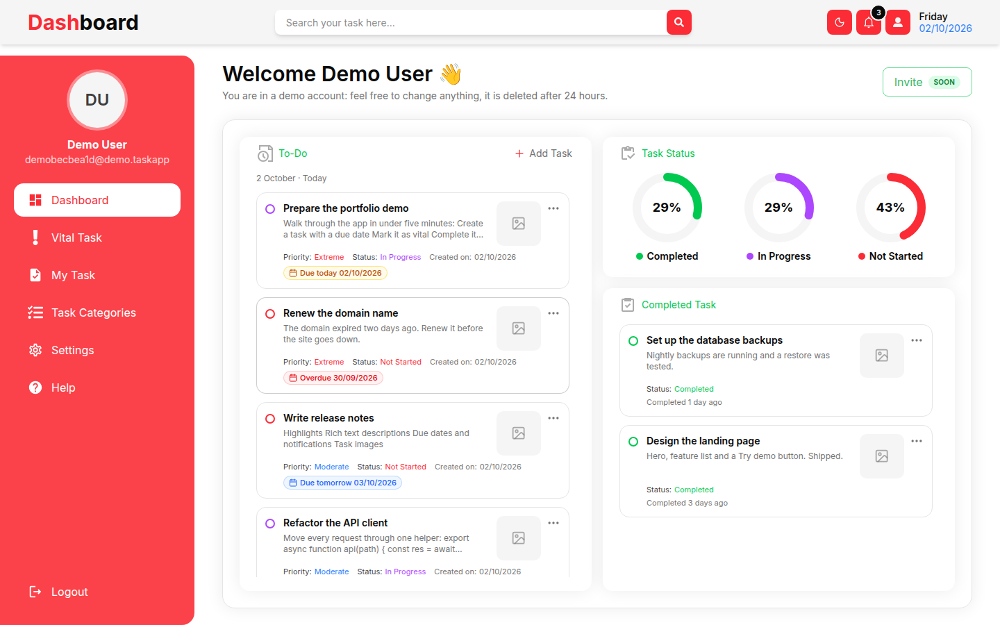
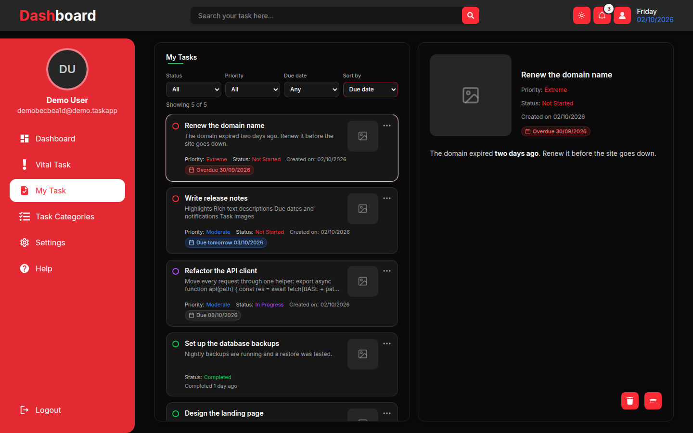
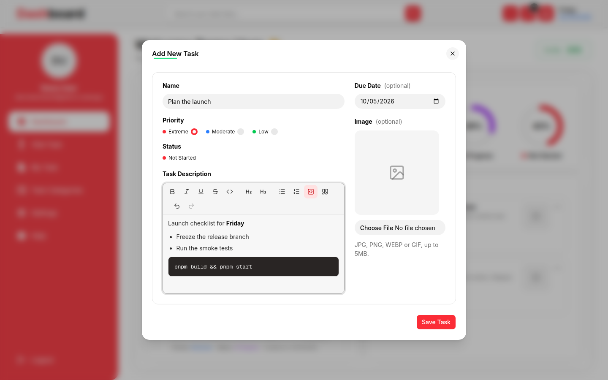
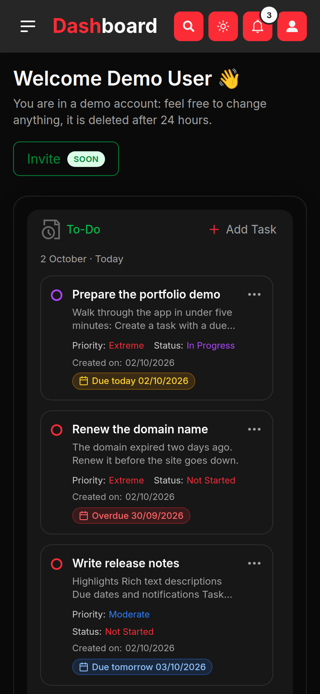
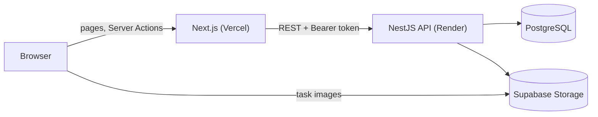

# TaskApp — Frontend

A task manager for planning, prioritizing and tracking work: due dates with reminders, rich-text notes, images, vital tasks, dark mode and a mobile layout.

**Live:** https://prodessional-task-app-front.vercel.app — press **Try the demo** to get your own sample account, no sign-up needed.
**Backend:** [Habibov97/Professional-TaskApp-Back](https://github.com/Habibov97/Professional-TaskApp-Back) · [API docs](https://professional-taskapp-back.onrender.com/docs)

| Dashboard | My tasks (dark mode) |
| --- | --- |
|  |  |

| Rich-text editor | Mobile |
| --- | --- |
|  |  |

## Features

- **Tasks**: create, edit, delete, priority and status, optional due date and image
- **Rich-text descriptions**: bold, italic, lists, headings, quotes and code blocks that keep their spacing
- **Due dates**: overdue / today / tomorrow badges and a notification bell for tasks that need attention
- **Vital tasks**: pin important tasks to their own list
- **Filters and sorting**: by status, priority and due date; sort by newest, due date or priority
- **Search** across titles and descriptions
- **Dashboard**: to-do list, completion rings per status, recently completed tasks
- **Account**: profile, password and profile photo
- **Task categories**: admins manage statuses and priorities; everyone else sees them read-only
- **Demo accounts**: one click creates a private account with sample data (deleted after 24 hours)
- **Dark mode**, responsive layout with a mobile drawer, loading and empty states

## Tech stack

- [Next.js 16](https://nextjs.org) (App Router, Server Components, Server Actions, `proxy.ts`)
- React 19, TypeScript
- Tailwind CSS 4, [shadcn/ui](https://ui.shadcn.com) on Radix primitives
- [Tiptap](https://tiptap.dev) editor, Zod validation, date-fns, Sonner toasts, next-themes

## How it works



- The browser never talks to the API directly. Pages are Server Components and every change goes through a **Server Action**, which calls the API with the user's token.
- **Auth**: the access and refresh tokens live in `httpOnly` cookies. `src/proxy.ts` refreshes an expired access token before the page renders, so sessions survive without client-side token handling.
- **Data loading** goes through cached helpers in `src/lib/api.ts`, so a page and its layout share one request per resource.
- **Descriptions** are stored as HTML. The API sanitizes them on save and the frontend sanitizes them again before rendering.
- The free backend host sleeps when idle; the login page wakes it up in the background and explains the wait if it takes long.

## Project structure

```
src/
  app/            routes: (auth) login/register, dashboard/*, api/wake
  actions/        Server Actions (auth, tasks, categories, account)
  components/     UI; components/ui holds the shadcn primitives
  lib/            API helpers, rich-text helpers, filters, config
  constants/      status/priority colors, due-date rules
  validations/    Zod schemas shared by forms and actions
  proxy.ts        token refresh for /dashboard routes
```

## Running locally

Requires Node.js 20+ and pnpm, plus the [backend](https://github.com/Habibov97/Professional-TaskApp-Back) running.

```bash
pnpm install
echo "API_URL=http://localhost:3001/api" > .env.local
pnpm dev
```

Open http://localhost:3000.

| Variable | Description |
| --- | --- |
| `API_URL` | Backend base URL including `/api`. `NEXT_PUBLIC_API_URL` is accepted as a fallback. |

Other scripts: `pnpm build`, `pnpm start`, `pnpm lint`.
